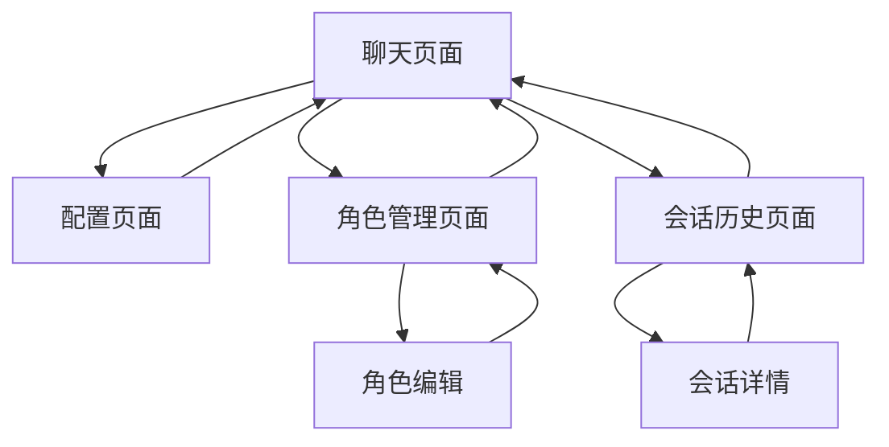

# AI聊天工具产品需求文档

## 1. 产品概述
一个轻量化的AI聊天工具，支持多种大语言模型配置和流式对话体验。
- 解决用户需要统一管理多个LLM服务、自定义AI角色和获得流畅聊天体验的问题。
- 面向开发者、AI爱好者和需要定制化AI助手的用户群体。
- 目标是提供一个简单易用、功能完整的AI聊天平台，支持快速部署和扩展。

## 2. 核心功能

### 2.1 用户角色
本产品采用单一用户模式，无需复杂的权限管理：

| 角色 | 注册方式 | 核心权限 |
|------|----------|----------|
| 默认用户 | 直接访问 | 可配置LLM设置、创建聊天会话、管理角色预设 |

### 2.2 功能模块
我们的AI聊天工具包含以下主要页面：
1. **聊天页面**：主要对话界面，消息展示，流式输出显示。
2. **配置页面**：LLM服务配置，API密钥管理，代理设置。
3. **角色管理页面**：预设角色创建，提示词编辑，角色切换。
4. **会话历史页面**：历史对话记录，会话管理，导出功能。

### 2.3 页面详情

| 页面名称 | 模块名称 | 功能描述 |
|----------|----------|----------|
| 聊天页面 | 对话界面 | 显示聊天消息，支持文本输入，实时流式响应展示 |
| 聊天页面 | 角色选择器 | 快速切换当前对话角色，显示角色名称和描述 |
| 聊天页面 | 模型选择器 | 选择当前使用的LLM模型，显示模型状态 |
| 配置页面 | LLM配置 | 添加和管理多个LLM服务（OpenAI、Claude、本地模型等） |
| 配置页面 | API设置 | 配置API密钥、基础URL、代理地址等连接参数 |
| 配置页面 | 系统设置 | 调整温度、最大令牌数等模型参数 |
| 角色管理页面 | 角色列表 | 显示所有预设角色，支持新建、编辑、删除操作 |
| 角色管理页面 | 角色编辑器 | 编辑角色名称、描述和系统提示词 |
| 会话历史页面 | 会话列表 | 显示历史聊天会话，支持搜索和筛选 |
| 会话历史页面 | 会话详情 | 查看特定会话的完整对话记录 |

## 3. 核心流程

**主要用户操作流程：**
1. 用户访问聊天页面，选择或创建AI角色
2. 在配置页面设置LLM服务和API密钥
3. 返回聊天页面开始对话，享受流式响应体验
4. 在角色管理页面创建和编辑自定义角色
5. 通过会话历史页面查看和管理对话记录

## 4. 用户界面设计

### 4.1 设计风格
- **主色调**：深蓝色 (#1e40af) 和浅灰色 (#f8fafc)
- **辅助色**：绿色 (#10b981) 用于成功状态，红色 (#ef4444) 用于错误提示
- **按钮样式**：圆角按钮，悬停效果，现代扁平化设计
- **字体**：系统默认字体栈，主要文本 16px，标题 20-24px
- **布局风格**：卡片式布局，左侧导航栏，响应式设计
- **图标风格**：简洁的线性图标，统一的视觉语言

### 4.2 页面设计概览

| 页面名称 | 模块名称 | UI元素 |
|----------|----------|--------|
| 聊天页面 | 对话界面 | 消息气泡样式，左右对齐布局，流式文本动画，深色/浅色主题切换 |
| 聊天页面 | 输入区域 | 多行文本框，发送按钮，角色和模型选择下拉菜单 |
| 配置页面 | 设置表单 | 标签页布局，输入框组，保存按钮，连接状态指示器 |
| 角色管理页面 | 角色卡片 | 网格布局，角色头像，名称描述，编辑删除按钮 |
| 会话历史页面 | 列表视图 | 时间线布局，会话标题，预览文本，搜索框 |

### 4.3 响应式设计
产品采用移动优先的响应式设计，支持桌面端和移动端访问，针对触摸交互进行优化。