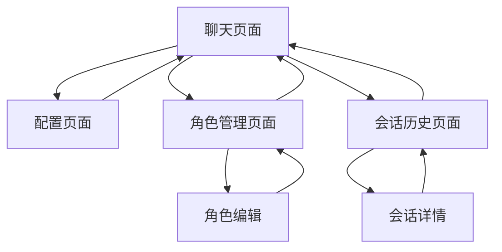

# AI聊天工具产品需求文档

## 1. 产品概述

一个轻量化的AI聊天工具，支持多种大语言模型配置和流式对话体验。

* 解决用户需要统一管理多个LLM服务、自定义AI角色和获得流畅聊天体验的问题。

* 面向开发者、AI爱好者和需要定制化AI助手的用户群体。

* 目标是提供一个简单易用、功能完整的AI聊天平台，支持快速部署和扩展。

## 2. 核心功能

### 2.1 用户角色

本产品采用单一用户模式，无需复杂的权限管理：

| 角色   | 注册方式      | 核心权限                   |
| ---- | --------- | ---------------------- |
| 默认用户 | 通过用户名密码访问 | 可配置LLM设置、创建聊天会话、管理角色预设 |

### 2.2 功能模块

我们的AI聊天工具包含以下主要页面：

1. **聊天页面**：主要对话界面，消息展示，流式输出显示。
2. **配置页面**：LLM服务配置，API密钥管理，代理设置。
3. **角色管理页面**：预设角色创建，提示词编辑，角色切换。
4. **会话历史页面**：历史对话记录，会话管理，导出功能。

### 2.3 页面详情

聊天页面

* 对话

  * 消息
  * 模型选择器
  * 消息列表

    * 置顶
    * 移除
    * 删除
* 配置

  * LLM 配置
  * 角色设置
  * 用户设置
  * 全局提示词

| 页面名称   | 模块名称  | 功能描述                   |
| ------ | ----- | ---------------------- |
| 聊天页面   | 对话界面  | 显示聊天消息，支持文本输入，实时流式响应展示 |
| 聊天页面   | 模型选择器 | 选择当前使用的LLM模型，显示模型状态    |
| 配置页面   | LLM配置 | 添加和管理多个LLM服务           |
| 配置页面   | 角色设置  | 角色卡                    |
| 配置页面   | 用户设置  | 参与对话的用户信息              |
| 配置页面   | 全局提示词 |                   |
| 配置页面   | 数据管理  | 编辑角色名称、描述和系统提示词        |
| 会话历史页面 | 会话列表  | 显示历史聊天会话，支持搜索和筛选       |
| 会话历史页面 | 会话详情  | 查看特定会话的完整对话记录          |

## 3. 核心流程

**主要用户操作流程：**

1. 用户访问聊天页面，选择或创建AI角色
2. 在配置页面设置LLM服务和API密钥
3. 返回聊天页面开始对话，享受流式响应体验
4. 在角色管理页面创建和编辑自定义角色
5. 通过会话历史页面查看和管理对话记录

##
