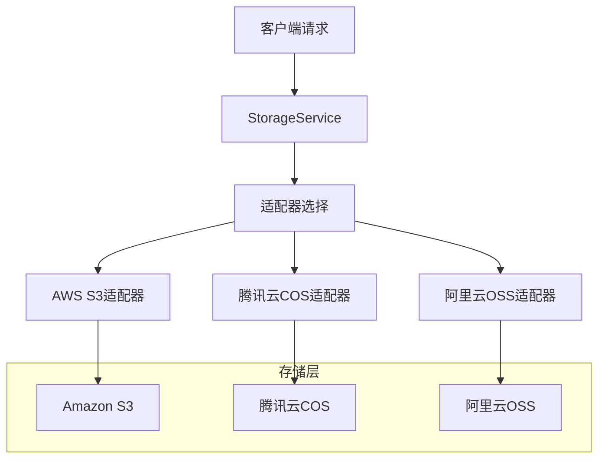
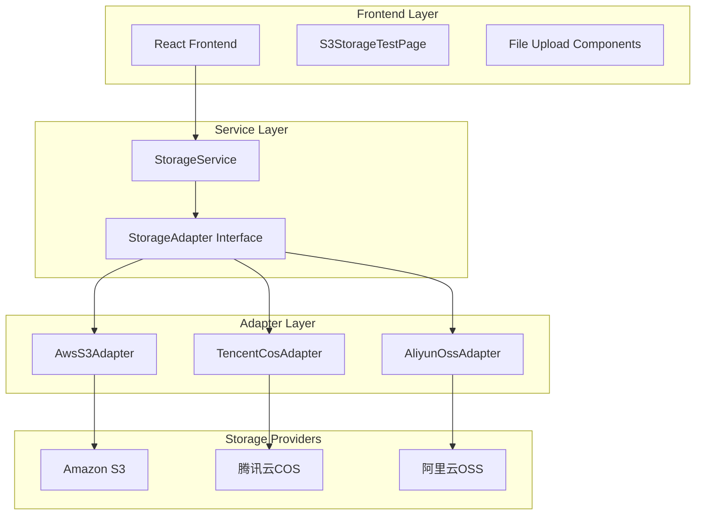

# AWS SDK 存储服务文档

## 1. 项目概述

基于 AWS SDK v3 实现的多云存储服务，支持 Amazon S3、腾讯云 COS 和阿里云 OSS。通过统一的接口提供文件上传、下载、删除和管理功能，适用于头像、附件等各类文件存储需求。

## 2. 核心功能

### 2.1 多云存储支持

| 云服务商 | 服务名称 | SDK兼容性 | 配置方式 |
|---------|---------|----------|----------|
| 亚马逊 | Amazon S3 | 原生支持 | 标准AWS配置 |
| 腾讯云 | 对象存储COS | S3兼容API | 自定义endpoint |
| 阿里云 | 对象存储OSS | S3兼容API | 自定义endpoint |

### 2.2 功能模块

我们的存储服务包含以下核心功能：

1. **文件上传管理**：支持单文件和批量上传，自动生成唯一文件名
2. **头像专用上传**：针对头像文件的优化上传方法
3. **文件删除管理**：支持单文件和批量删除操作
4. **签名URL生成**：为私有文件生成临时访问链接
5. **文件列表查询**：按前缀查询存储桶中的文件
6. **多云适配器**：统一接口支持不同云服务商

### 2.3 页面功能详情

| 功能模块 | 方法名称 | 功能描述 |
|---------|---------|----------|
| 文件上传 | uploadFile | 上传文件到指定文件夹，支持自定义文件名和元数据 |
| 头像上传 | uploadAvatar | 专用头像上传方法，自动设置为公开访问 |
| 文件删除 | deleteFile | 删除指定存储键的文件 |
| 批量删除 | deleteFiles | 批量删除多个文件 |
| 签名URL | getSignedUrl | 生成私有文件的临时访问链接 |
| 文件列表 | listFiles | 列出指定前缀的所有文件 |

## 3. 核心流程

### 用户文件上传流程
1. 用户选择文件 → 2. 验证文件类型和大小 → 3. 生成唯一存储键 → 4. 转换为ArrayBuffer → 5. 上传到云存储 → 6. 返回文件元数据

### 头像上传流程
1. 选择头像文件 → 2. 调用uploadAvatar方法 → 3. 自动设置avatars文件夹 → 4. 设置公开访问权限 → 5. 返回访问URL

### 文件访问流程
1. 请求文件访问 → 2. 检查文件权限 → 3. 生成签名URL（私有文件） → 4. 返回访问链接



## 4. 用户界面设计

### 4.1 设计风格
- 主色调：蓝色系（#3B82F6）表示云存储，绿色系（#10B981）表示成功状态
- 按钮风格：圆角设计，支持上传进度显示和加载状态
- 字体：系统默认字体，文件信息使用等宽字体显示
- 布局风格：卡片式布局，支持拖拽上传和文件预览
- 图标风格：使用 Lucide React 图标库（Upload、Download、Trash2等）

### 4.2 页面设计概览

| 页面名称 | 模块名称 | UI元素 |
|---------|---------|--------|
| 存储测试页 | 文件上传区 | 文件选择按钮、上传进度、文件列表展示 |
| 存储测试页 | 操作按钮组 | 上传、删除、获取签名URL、列出文件按钮 |
| 存储测试页 | 文件预览区 | 缩略图、文件信息、操作按钮 |
| 存储测试页 | 消息提示区 | 成功/错误消息显示，自动消失 |

### 4.3 响应式设计
采用移动优先的响应式设计，文件上传和管理功能在桌面端和移动端均可正常使用，针对触屏设备优化操作体验。

## 5. 技术架构

### 5.1 架构设计



### 5.2 技术描述

- Frontend: React@18 + TypeScript + Vite
- Storage SDK: @aws-sdk/client-s3@3 + @aws-sdk/s3-request-presigner@3
- Utilities: uuid@9 + mime-types@2
- Icons: lucide-react
- Environment: Browser-based with import.meta.env

### 5.3 核心类型定义

```typescript
// 存储配置接口
export interface StorageConfig {
  provider: 'aws' | 'tencent' | 'aliyun';
  accessKeyId: string;
  secretAccessKey: string;
  region: string;
  bucket: string;
  endpoint?: string;
}

// 上传选项接口
export interface UploadOptions {
  key: string;
  file: File;
  contentType?: string;
  isPublic?: boolean;
  metadata?: Record<string, string>;
}

// 上传结果接口
export interface UploadResult {
  key: string;
  url: string;
  etag: string;
  size: number;
}

// 文件元数据接口
export interface FileMetadata {
  id: string;
  originalName: string;
  storageKey: string;
  fileSize: number;
  mimeType: string;
  storageProvider: string;
  accessUrl: string;
  isPublic: boolean;
  metadata?: Record<string, any>;
}
```

## 6. 环境配置

### 6.1 环境变量设置

```bash
# .env.local
# 存储服务提供商 (aws/tencent/aliyun)
VITE_STORAGE_PROVIDER=aws

# 访问凭证
VITE_STORAGE_ACCESS_KEY_ID=your_access_key_id
VITE_STORAGE_SECRET_ACCESS_KEY=your_secret_access_key

# 存储区域和桶名
VITE_STORAGE_REGION=us-east-1
VITE_STORAGE_BUCKET=your-bucket-name

# 自定义端点（腾讯云和阿里云需要）
VITE_STORAGE_ENDPOINT=https://cos.ap-beijing.myqcloud.com
```

### 6.2 依赖安装

```bash
# 安装AWS SDK v3核心包
npm install @aws-sdk/client-s3 @aws-sdk/s3-request-presigner

# 安装工具库
npm install uuid mime-types
npm install --save-dev @types/uuid @types/mime-types
```

## 7. 使用示例

### 7.1 基础使用

```typescript
import { createStorageService } from '../services/storage/StorageService';

// 创建存储服务实例
const storageService = createStorageService();

if (storageService) {
  // 上传文件
  const fileMetadata = await storageService.uploadFile(file, {
    folder: 'uploads',
    filename: 'custom-name.jpg',
    isPublic: true,
    metadata: { userId: 'user123' }
  });
  
  // 上传头像
  const avatarMetadata = await storageService.uploadAvatar(avatarFile, 'user123');
  
  // 获取签名URL
  const signedUrl = await storageService.getSignedUrl(fileMetadata.storageKey, 3600);
  
  // 删除文件
  await storageService.deleteFile(fileMetadata.storageKey);
  
  // 列出文件
  const fileKeys = await storageService.listFiles('uploads/');
}
```

### 7.2 React组件中使用

```typescript
import React, { useState } from 'react';
import { createStorageService } from '../services/storage/StorageService';

const FileUploadComponent: React.FC = () => {
  const [storageService] = useState(() => createStorageService());
  const [uploading, setUploading] = useState(false);
  
  const handleFileUpload = async (event: React.ChangeEvent<HTMLInputElement>) => {
    const file = event.target.files?.[0];
    if (!file || !storageService) return;
    
    setUploading(true);
    try {
      const result = await storageService.uploadFile(file, {
        folder: 'user-uploads',
        isPublic: true
      });
      console.log('Upload successful:', result);
    } catch (error) {
      console.error('Upload failed:', error);
    } finally {
      setUploading(false);
    }
  };
  
  return (
    <div>
      <input type="file" onChange={handleFileUpload} disabled={uploading} />
      {uploading && <p>上传中...</p>}
    </div>
  );
};
```

## 8. 最佳实践

### 8.1 文件命名策略
- 使用UUID生成唯一文件名，避免文件名冲突
- 保留原始文件扩展名，便于类型识别
- 按功能分文件夹存储（avatars/、uploads/、temp/等）

### 8.2 安全考虑
- 敏感配置通过环境变量管理，不要硬编码
- 私有文件使用签名URL，设置合理的过期时间
- 公开文件设置适当的访问权限

### 8.3 性能优化
- 大文件上传前进行客户端压缩
- 使用适当的MIME类型，提高传输效率
- 合理设置文件生命周期，自动清理临时文件

### 8.4 错误处理
- 上传前验证文件类型和大小
- 网络错误时提供重试机制
- 提供清晰的错误提示信息

## 9. 故障排除

### 9.1 常见问题

**问题：存储服务初始化失败**
- 检查环境变量是否正确设置
- 验证访问凭证是否有效
- 确认存储桶名称和区域配置

**问题：文件上传失败**
- 检查文件大小是否超出限制
- 验证存储桶权限设置
- 确认网络连接状态

**问题：无法访问上传的文件**
- 检查文件ACL权限设置
- 验证存储桶的公开访问策略
- 确认文件URL格式是否正确

### 9.2 调试方法
- 启用浏览器开发者工具查看网络请求
- 检查控制台错误信息
- 使用存储服务提供商的管理控制台验证文件状态

这个文档基于当前实际实现的AWS SDK存储服务，提供了完整的使用指南和最佳实践建议。