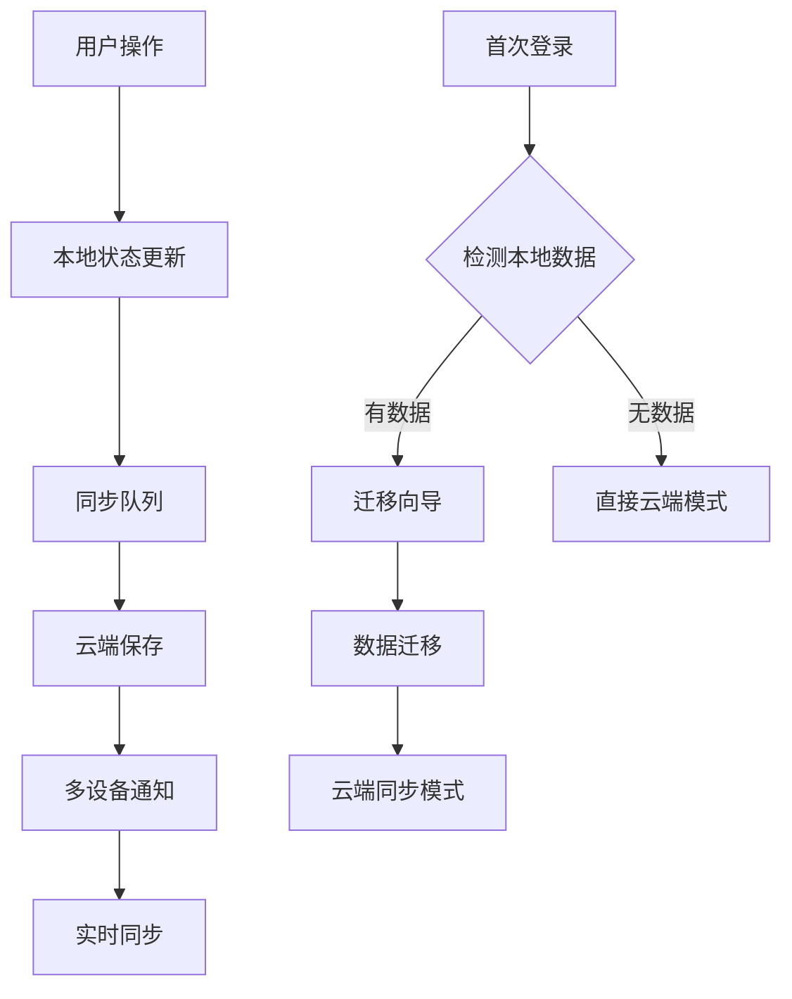
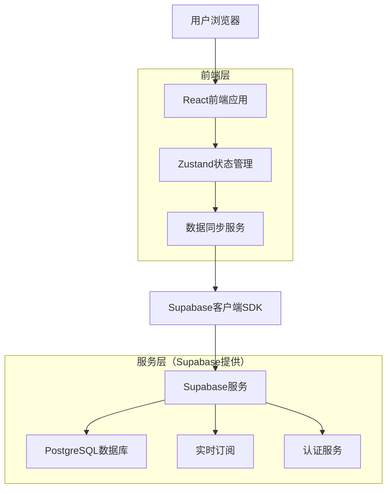
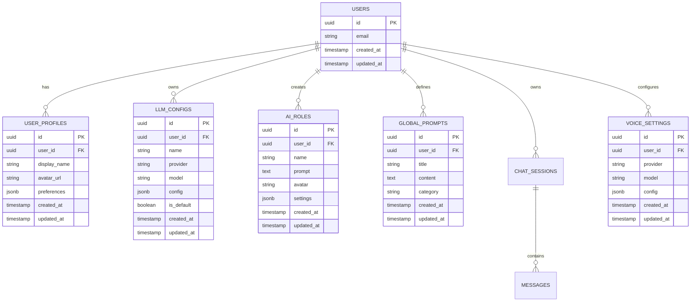

# AI聊天工具数据同步改造方案

## 1. 项目概述

本文档提出了将AI聊天工具的所有数据信息同步到数据库的全面改造方案。基于现有的Supabase + React架构，在保持开源项目轻量化和易用性的前提下，实现完整的数据云端同步功能。

- 核心目标：将当前部分本地存储的数据（LLM配置、AI角色、用户资料等）全面迁移到云端数据库
- 设计原则：渐进式改造、向后兼容、用户体验优先
- 技术价值：提供企业级数据管理能力，同时保持个人开发者友好的部署体验

## 2. 核心功能

### 2.1 用户角色

| 角色 | 数据同步范围 | 核心权限 |
|------|-------------|----------|
| 游客用户 | 仅本地临时存储 | 体验基础功能，数据不持久化 |
| 注册用户 | 全量云端同步 | 所有配置和数据云端保存，多设备同步 |

### 2.2 功能模块

我们的数据同步改造包含以下核心模块：

1. **数据迁移模块**：现有本地数据向云端迁移，支持批量导入导出
2. **实时同步模块**：配置变更实时保存到云端，多设备数据一致性
3. **离线支持模块**：网络断开时本地缓存，恢复后自动同步
4. **数据管理模块**：用户数据备份、恢复、清理功能

### 2.3 页面详情

| 页面名称 | 模块名称 | 功能描述 |
|-----------|-------------|---------------------|
| 聊天页面 | 数据同步状态 | 显示同步状态指示器，支持手动同步触发 |
| 设置页面 | 配置同步 | LLM配置、AI角色、全局提示词实时云端保存 |
| 用户中心 | 数据管理 | 数据导入导出、同步历史、存储使用情况 |
| 迁移向导 | 数据迁移 | 首次登录用户的本地数据迁移引导 |

## 3. 核心流程

### 数据同步流程

1. 用户操作（修改配置、创建角色等） → 本地状态更新 → 云端同步队列
2. 同步服务检测变更 → 批量提交到Supabase → 更新同步状态
3. 多设备场景 → 实时订阅数据变更 → 自动拉取最新数据 → 本地状态同步

### 数据迁移流程

1. 用户首次登录 → 检测本地数据 → 显示迁移向导
2. 用户确认迁移 → 数据格式转换 → 批量上传到云端
3. 迁移完成 → 本地数据标记为已迁移 → 切换到云端同步模式



## 4. 用户界面设计

### 4.1 设计风格

- 主色调：继承现有DaisyUI主题配色
- 按钮样式：保持现有DaisyUI组件风格
- 字体：使用系统默认字体栈
- 布局风格：卡片式设计，顶部导航
- 图标风格：使用Heroicons图标库，同步状态使用动画效果

### 4.2 页面设计概览

| 页面名称 | 模块名称 | UI元素 |
|-----------|-------------|-------------|
| 设置页面 | 同步状态指示器 | 右上角云朵图标，绿色表示已同步，橙色表示同步中，红色表示同步失败 |
| 迁移向导 | 数据迁移界面 | 全屏模态框，进度条，数据项清单，确认按钮 |
| 用户中心 | 数据管理面板 | 存储使用量图表，同步历史列表，导入导出按钮 |

### 4.3 响应式设计

移动端优先设计，桌面端和移动端自适应，支持触摸交互优化。

## 5. 技术架构

### 5.1 架构设计



### 5.2 技术描述

- 前端：React@18 + TypeScript + Tailwind CSS + DaisyUI + Vite
- 状态管理：Zustand（增强版，支持云端同步）
- 数据库：Supabase PostgreSQL + 行级安全策略
- 实时同步：Supabase Realtime

### 5.3 路由定义

| 路由 | 用途 |
|-------|----------|
| /chat | 聊天页面，显示同步状态和历史会话 |
| /settings | 设置页面，所有配置支持云端同步 |
| /profile | 用户中心，数据管理和同步控制 |
| /migrate | 数据迁移向导，首次用户引导 |

## 6. 数据模型

### 6.1 数据模型定义



### 6.2 数据定义语言

**LLM配置表（llm_configs）**
```sql
-- 创建LLM配置表
CREATE TABLE llm_configs (
    id UUID PRIMARY KEY DEFAULT gen_random_uuid(),
    user_id UUID REFERENCES auth.users(id) ON DELETE CASCADE,
    name VARCHAR(100) NOT NULL,
    provider VARCHAR(50) NOT NULL,
    model VARCHAR(100) NOT NULL,
    config JSONB DEFAULT '{}',
    is_default BOOLEAN DEFAULT false,
    created_at TIMESTAMP WITH TIME ZONE DEFAULT NOW(),
    updated_at TIMESTAMP WITH TIME ZONE DEFAULT NOW()
);

-- 创建索引
CREATE INDEX idx_llm_configs_user_id ON llm_configs(user_id);
CREATE INDEX idx_llm_configs_provider ON llm_configs(provider);
CREATE UNIQUE INDEX idx_llm_configs_user_default ON llm_configs(user_id) WHERE is_default = true;

-- 启用行级安全
ALTER TABLE llm_configs ENABLE ROW LEVEL SECURITY;

-- 创建RLS策略
CREATE POLICY "用户只能访问自己的LLM配置" ON llm_configs
    FOR ALL USING (auth.uid() = user_id);
```

**AI角色表（ai_roles）**
```sql
-- 创建AI角色表
CREATE TABLE ai_roles (
    id UUID PRIMARY KEY DEFAULT gen_random_uuid(),
    user_id UUID REFERENCES auth.users(id) ON DELETE CASCADE,
    name VARCHAR(100) NOT NULL,
    prompt TEXT NOT NULL,
    avatar VARCHAR(200),
    settings JSONB DEFAULT '{}',
    created_at TIMESTAMP WITH TIME ZONE DEFAULT NOW(),
    updated_at TIMESTAMP WITH TIME ZONE DEFAULT NOW()
);

-- 创建索引
CREATE INDEX idx_ai_roles_user_id ON ai_roles(user_id);
CREATE INDEX idx_ai_roles_name ON ai_roles(name);

-- 启用行级安全
ALTER TABLE ai_roles ENABLE ROW LEVEL SECURITY;

-- 创建RLS策略
CREATE POLICY "用户只能访问自己的AI角色" ON ai_roles
    FOR ALL USING (auth.uid() = user_id);
```

**全局提示词表（global_prompts）**
```sql
-- 创建全局提示词表
CREATE TABLE global_prompts (
    id UUID PRIMARY KEY DEFAULT gen_random_uuid(),
    user_id UUID REFERENCES auth.users(id) ON DELETE CASCADE,
    title VARCHAR(200) NOT NULL,
    content TEXT NOT NULL,
    category VARCHAR(50) DEFAULT 'general',
    created_at TIMESTAMP WITH TIME ZONE DEFAULT NOW(),
    updated_at TIMESTAMP WITH TIME ZONE DEFAULT NOW()
);

-- 创建索引
CREATE INDEX idx_global_prompts_user_id ON global_prompts(user_id);
CREATE INDEX idx_global_prompts_category ON global_prompts(category);

-- 启用行级安全
ALTER TABLE global_prompts ENABLE ROW LEVEL SECURITY;

-- 创建RLS策略
CREATE POLICY "用户只能访问自己的全局提示词" ON global_prompts
    FOR ALL USING (auth.uid() = user_id);
```

**语音设置表（voice_settings）**
```sql
-- 创建语音设置表
CREATE TABLE voice_settings (
    id UUID PRIMARY KEY DEFAULT gen_random_uuid(),
    user_id UUID REFERENCES auth.users(id) ON DELETE CASCADE,
    provider VARCHAR(50) NOT NULL DEFAULT 'openai',
    model VARCHAR(100) NOT NULL DEFAULT 'tts-1',
    config JSONB DEFAULT '{}',
    created_at TIMESTAMP WITH TIME ZONE DEFAULT NOW(),
    updated_at TIMESTAMP WITH TIME ZONE DEFAULT NOW()
);

-- 创建索引
CREATE UNIQUE INDEX idx_voice_settings_user_id ON voice_settings(user_id);

-- 启用行级安全
ALTER TABLE voice_settings ENABLE ROW LEVEL SECURITY;

-- 创建RLS策略
CREATE POLICY "用户只能访问自己的语音设置" ON voice_settings
    FOR ALL USING (auth.uid() = user_id);
```

## 7. 数据同步策略

### 7.1 渐进式同步策略

**阶段1：核心数据同步（必需）**
- LLM配置：模型设置、API密钥、默认配置
- AI角色：自定义角色、提示词、头像设置
- 聊天会话：会话历史、消息记录

**阶段2：扩展数据同步（重要）**
- 全局提示词：用户自定义提示词库
- 语音设置：TTS配置、语音偏好
- 用户偏好：主题设置、界面配置

**阶段3：高级功能同步（可选）**
- 使用统计：聊天次数、模型使用情况
- 导入导出：数据备份、迁移记录
- 分享设置：角色分享、提示词分享

### 7.2 同步机制设计

**实时同步**
```typescript
// 数据同步服务
class DataSyncService {
  private syncQueue: SyncItem[] = [];
  private isOnline = navigator.onLine;
  
  // 添加到同步队列
  async queueSync(type: string, data: any) {
    const item: SyncItem = {
      id: generateId(),
      type,
      data,
      timestamp: Date.now(),
      retries: 0
    };
    
    this.syncQueue.push(item);
    
    if (this.isOnline) {
      await this.processSyncQueue();
    }
  }
  
  // 处理同步队列
  private async processSyncQueue() {
    while (this.syncQueue.length > 0) {
      const item = this.syncQueue.shift()!;
      
      try {
        await this.syncToCloud(item);
      } catch (error) {
        if (item.retries < 3) {
          item.retries++;
          this.syncQueue.unshift(item);
          await new Promise(resolve => setTimeout(resolve, 1000 * item.retries));
        } else {
          console.error('同步失败，已达到最大重试次数:', error);
        }
      }
    }
  }
  
  // 同步到云端
  private async syncToCloud(item: SyncItem) {
    const { type, data } = item;
    
    switch (type) {
      case 'llm_config':
        await supabase.from('llm_configs').upsert(data);
        break;
      case 'ai_role':
        await supabase.from('ai_roles').upsert(data);
        break;
      case 'global_prompt':
        await supabase.from('global_prompts').upsert(data);
        break;
      // ... 其他数据类型
    }
  }
}
```

**离线支持**
```typescript
// 离线数据管理
class OfflineDataManager {
  private offlineQueue: OfflineItem[] = [];
  
  // 网络状态监听
  constructor() {
    window.addEventListener('online', this.handleOnline.bind(this));
    window.addEventListener('offline', this.handleOffline.bind(this));
  }
  
  private async handleOnline() {
    console.log('网络已连接，开始同步离线数据');
    await this.syncOfflineData();
  }
  
  private handleOffline() {
    console.log('网络已断开，切换到离线模式');
  }
  
  // 同步离线数据
  private async syncOfflineData() {
    for (const item of this.offlineQueue) {
      try {
        await this.syncService.queueSync(item.type, item.data);
        this.removeFromOfflineQueue(item.id);
      } catch (error) {
        console.error('离线数据同步失败:', error);
      }
    }
  }
}
```

### 7.3 数据迁移策略

**本地数据检测**
```typescript
// 数据迁移服务
class DataMigrationService {
  // 检测本地数据
  async detectLocalData(): Promise<MigrationData> {
    const localStorage = window.localStorage;
    const migrationData: MigrationData = {
      llmConfigs: [],
      aiRoles: [],
      globalPrompts: [],
      voiceSettings: null,
      chatSessions: [],
      userRoles: []
    };
    
    // 检测LLM配置
    const llmConfigsData = localStorage.getItem('llm-configs');
    if (llmConfigsData) {
      migrationData.llmConfigs = JSON.parse(llmConfigsData);
    }
    
    // 检测AI角色
    const aiRolesData = localStorage.getItem('ai-roles');
    if (aiRolesData) {
      migrationData.aiRoles = JSON.parse(aiRolesData);
    }
    
    // ... 检测其他数据类型
    
    return migrationData;
  }
  
  // 执行数据迁移
  async migrateData(migrationData: MigrationData): Promise<MigrationResult> {
    const results: MigrationResult = {
      success: true,
      migratedItems: 0,
      errors: []
    };
    
    try {
      // 迁移LLM配置
      for (const config of migrationData.llmConfigs) {
        await this.migrateLLMConfig(config);
        results.migratedItems++;
      }
      
      // 迁移AI角色
      for (const role of migrationData.aiRoles) {
        await this.migrateAIRole(role);
        results.migratedItems++;
      }
      
      // ... 迁移其他数据
      
    } catch (error) {
      results.success = false;
      results.errors.push(error.message);
    }
    
    return results;
  }
}
```

## 8. 用户体验优化

### 8.1 同步状态指示

**视觉反馈**
- 同步成功：绿色云朵图标，"已同步"提示
- 同步中：橙色云朵图标，旋转动画，"同步中"提示
- 同步失败：红色云朵图标，"同步失败"提示，点击重试
- 离线模式：灰色云朵图标，"离线模式"提示

**交互设计**
```typescript
// 同步状态组件
const SyncStatusIndicator: React.FC = () => {
  const { syncStatus, lastSyncTime, retrySync } = useSyncStatus();
  
  const getStatusIcon = () => {
    switch (syncStatus) {
      case 'synced':
        return <CloudIcon className="w-5 h-5 text-green-500" />;
      case 'syncing':
        return <CloudIcon className="w-5 h-5 text-orange-500 animate-spin" />;
      case 'error':
        return <ExclamationTriangleIcon className="w-5 h-5 text-red-500" />;
      case 'offline':
        return <CloudIcon className="w-5 h-5 text-gray-400" />;
    }
  };
  
  return (
    <div className="flex items-center space-x-2">
      {getStatusIcon()}
      <span className="text-sm text-gray-600">
        {syncStatus === 'synced' && `已同步 ${formatTime(lastSyncTime)}`}
        {syncStatus === 'syncing' && '同步中...'}
        {syncStatus === 'error' && (
          <button onClick={retrySync} className="text-red-500 hover:underline">
            同步失败，点击重试
          </button>
        )}
        {syncStatus === 'offline' && '离线模式'}
      </span>
    </div>
  );
};
```

### 8.2 数据迁移向导

**迁移流程设计**
1. 检测阶段：自动扫描本地数据，显示可迁移项目清单
2. 确认阶段：用户选择要迁移的数据类型，预览迁移内容
3. 执行阶段：显示迁移进度，实时反馈迁移状态
4. 完成阶段：显示迁移结果，提供数据验证选项

**迁移界面组件**
```typescript
// 数据迁移向导
const DataMigrationWizard: React.FC = () => {
  const [step, setStep] = useState(1);
  const [migrationData, setMigrationData] = useState<MigrationData | null>(null);
  const [migrationProgress, setMigrationProgress] = useState(0);
  
  const steps = [
    { id: 1, title: '检测本地数据', component: DetectionStep },
    { id: 2, title: '选择迁移项目', component: SelectionStep },
    { id: 3, title: '执行迁移', component: MigrationStep },
    { id: 4, title: '完成迁移', component: CompletionStep }
  ];
  
  return (
    <div className="fixed inset-0 bg-black bg-opacity-50 flex items-center justify-center z-50">
      <div className="bg-white rounded-lg p-6 w-full max-w-2xl max-h-[80vh] overflow-y-auto">
        <div className="mb-6">
          <h2 className="text-2xl font-bold text-gray-900 mb-2">
            数据迁移向导
          </h2>
          <div className="flex items-center space-x-2">
            {steps.map((s, index) => (
              <div key={s.id} className="flex items-center">
                <div className={`w-8 h-8 rounded-full flex items-center justify-center text-sm font-medium ${
                  step >= s.id ? 'bg-blue-500 text-white' : 'bg-gray-200 text-gray-600'
                }`}>
                  {s.id}
                </div>
                {index < steps.length - 1 && (
                  <div className={`w-12 h-1 ${
                    step > s.id ? 'bg-blue-500' : 'bg-gray-200'
                  }`} />
                )}
              </div>
            ))}
          </div>
        </div>
        
        <div className="mb-6">
          {steps.find(s => s.id === step)?.component && (
            <steps.find(s => s.id === step)!.component
              migrationData={migrationData}
              setMigrationData={setMigrationData}
              progress={migrationProgress}
              setProgress={setMigrationProgress}
              onNext={() => setStep(step + 1)}
              onPrev={() => setStep(step - 1)}
            />
          )}
        </div>
      </div>
    </div>
  );
};
```

### 8.3 性能优化

**批量同步**
- 将多个小的数据变更合并为批量操作
- 使用防抖机制避免频繁的网络请求
- 优先同步用户当前正在使用的数据

**缓存策略**
- 本地缓存云端数据，减少网络请求
- 使用版本号机制检测数据变更
- 实现智能预加载，提升用户体验

## 9. 实施计划

### 9.1 阶段1：数据库表结构创建（1周）

**任务清单：**
- [ ] 创建LLM配置表和相关索引
- [ ] 创建AI角色表和RLS策略
- [ ] 创建全局提示词表
- [ ] 创建语音设置表
- [ ] 编写数据库初始化脚本
- [ ] 测试表结构和权限设置

**交付物：**
- 完整的数据库DDL脚本
- 数据库初始化工具
- 表结构文档

### 9.2 阶段2：数据同步服务开发（2周）

**任务清单：**
- [ ] 开发数据同步服务类
- [ ] 实现实时同步机制
- [ ] 添加离线支持功能
- [ ] 创建同步状态管理
- [ ] 实现错误处理和重试逻辑
- [ ] 编写单元测试

**交付物：**
- 数据同步服务模块
- 离线数据管理器
- 同步状态指示器组件
- 测试用例

### 9.3 阶段3：数据迁移功能开发（1.5周）

**任务清单：**
- [ ] 开发本地数据检测功能
- [ ] 创建数据迁移向导界面
- [ ] 实现批量数据迁移逻辑
- [ ] 添加迁移进度反馈
- [ ] 实现迁移结果验证
- [ ] 测试各种迁移场景

**交付物：**
- 数据迁移服务
- 迁移向导组件
- 迁移进度界面
- 迁移测试报告

### 9.4 阶段4：用户界面集成（1周）

**任务清单：**
- [ ] 集成同步状态指示器到各个页面
- [ ] 更新设置页面支持实时同步
- [ ] 添加数据管理功能到用户中心
- [ ] 实现首次登录迁移引导
- [ ] 优化移动端体验
- [ ] 进行用户体验测试

**交付物：**
- 更新的用户界面
- 同步状态指示器
- 数据管理面板
- 移动端适配

### 9.5 阶段5：测试和优化（1周）

**任务清单：**
- [ ] 端到端功能测试
- [ ] 性能测试和优化
- [ ] 多设备同步测试
- [ ] 网络异常场景测试
- [ ] 用户接受度测试
- [ ] 文档更新和完善

**交付物：**
- 测试报告
- 性能优化方案
- 用户使用指南
- 技术文档更新

## 10. 风险评估

### 10.1 技术风险

**数据一致性风险**
- 风险：多设备同步时可能出现数据冲突
- 缓解：实现冲突检测和解决机制，使用时间戳和版本号
- 应急：提供手动数据恢复功能

**性能风险**
- 风险：大量数据同步可能影响应用性能
- 缓解：实现批量同步和增量更新，使用后台同步
- 应急：提供同步开关，允许用户控制同步频率

**网络依赖风险**
- 风险：网络不稳定可能导致同步失败
- 缓解：实现离线支持和自动重试机制
- 应急：保证离线模式下应用正常使用

### 10.2 用户体验风险

**迁移复杂性风险**
- 风险：数据迁移过程可能让用户感到困惑
- 缓解：提供清晰的迁移向导和进度反馈
- 应急：支持跳过迁移，后续手动触发

**数据丢失风险**
- 风险：迁移过程中可能出现数据丢失
- 缓解：迁移前自动备份本地数据
- 应急：提供数据恢复功能和客服支持

### 10.3 安全风险

**数据泄露风险**
- 风险：云端存储可能面临安全威胁
- 缓解：使用Supabase的行级安全策略，加密敏感数据
- 应急：提供数据导出和删除功能

**权限控制风险**
- 风险：RLS策略配置错误可能导致数据越权访问
- 缓解：严格测试权限设置，定期安全审计
- 应急：监控异常访问，及时修复权限问题

## 11. 成功指标

### 11.1 技术指标

- **同步成功率**：≥ 99.5%
- **同步延迟**：≤ 2秒
- **离线支持**：支持7天离线使用
- **数据迁移成功率**：≥ 98%
- **应用性能影响**：≤ 5%性能下降

### 11.2 用户体验指标

- **迁移完成率**：≥ 85%的用户完成数据迁移
- **用户满意度**：≥ 4.5/5.0
- **支持工单减少**：数据相关问题减少70%
- **多设备使用率**：≥ 40%的用户使用多设备

### 11.3 业务指标

- **用户留存率**：注册用户7天留存率≥ 60%
- **功能使用率**：≥ 70%的用户使用云端同步功能
- **部署成功率**：≥ 95%的新用户成功完成部署

## 12. 总结

本数据同步改造方案在保持AI聊天工具轻量化和易用性的前提下，实现了全面的云端数据同步功能。通过渐进式的改造策略、用户友好的迁移向导和强大的离线支持，为用户提供了企业级的数据管理能力。

**核心优势：**
- 保持现有架构的简洁性，最小化改动成本
- 提供完整的数据同步解决方案，支持多设备使用
- 实现平滑的数据迁移体验，降低用户学习成本
- 确保数据安全和隐私保护，符合开源项目标准

**预期效果：**
- 显著提升用户体验和数据安全性
- 增强产品竞争力和用户粘性
- 为后续功能扩展奠定坚实基础
- 维持开源项目的轻量化特色

通过本方案的实施，AI聊天工具将成为一个功能完整、易于使用、数据安全的现代化AI应用，为用户提供卓越的智能对话体验。