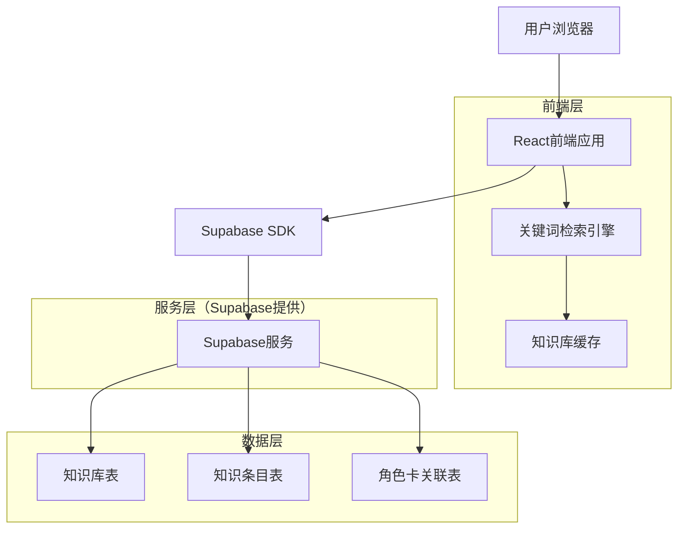
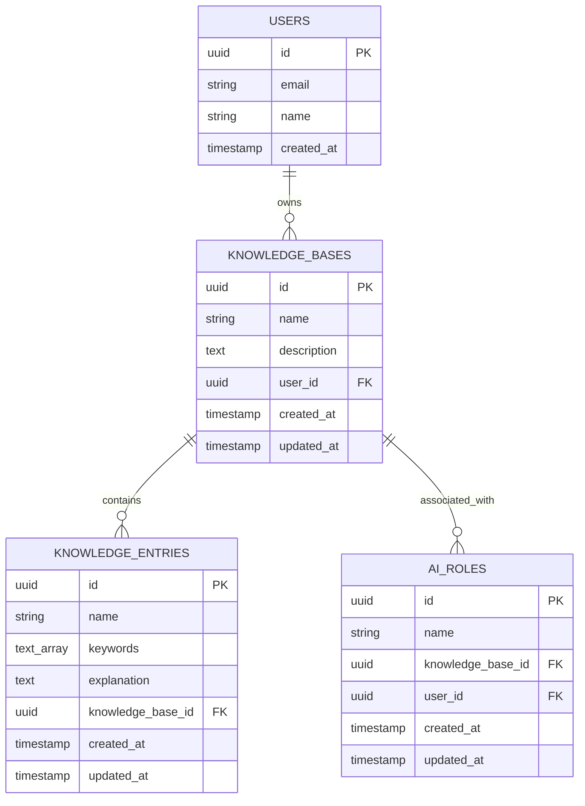

# 知识库功能技术架构文档

## 1. 架构设计



## 2. 技术描述

- 前端：React@18 + TypeScript + TailwindCSS@3 + Vite
- 后端：Supabase（PostgreSQL数据库 + 实时订阅 + 认证）
- 检索引擎：前端JavaScript实现的关键词匹配算法
- 缓存：浏览器本地存储 + React状态管理

## 3. 路由定义

| 路由 | 用途 |
|------|------|
| /settings/knowledge | 知识库管理主页面，显示知识库列表和管理功能 |
| /settings/knowledge/:id | 知识条目管理页面，管理指定知识库的条目 |
| /settings/knowledge/:id/entry/:entryId | 编辑知识条目页面，编辑指定条目的详细信息 |
| /settings/roles | 角色卡配置页面，为角色卡关联知识库 |

## 4. API定义

### 4.1 核心API

#### 知识库管理

**获取知识库列表**
```sql
SELECT * FROM knowledge_bases WHERE user_id = $1 ORDER BY created_at DESC
```

**创建知识库**
```sql
INSERT INTO knowledge_bases (name, description, user_id) VALUES ($1, $2, $3)
```

**更新知识库**
```sql
UPDATE knowledge_bases SET name = $1, description = $2 WHERE id = $3 AND user_id = $4
```

#### 知识条目管理

**获取条目列表**
```sql
SELECT * FROM knowledge_entries WHERE knowledge_base_id = $1 ORDER BY created_at DESC
```

**创建知识条目**
```sql
INSERT INTO knowledge_entries (name, keywords, explanation, knowledge_base_id) VALUES ($1, $2, $3, $4)
```

**关键词搜索**
```sql
SELECT * FROM knowledge_entries 
WHERE knowledge_base_id = $1 AND keywords @> $2
ORDER BY array_length(keywords, 1) DESC
```

#### 角色卡关联

**设置角色卡知识库**
```sql
UPDATE ai_roles SET knowledge_base_id = $1 WHERE id = $2 AND user_id = $3
```

## 5. 数据模型

### 5.1 数据模型定义



### 5.2 数据定义语言

#### 知识库表 (knowledge_bases)
```sql
-- 创建知识库表
CREATE TABLE knowledge_bases (
    id UUID PRIMARY KEY DEFAULT gen_random_uuid(),
    name VARCHAR(255) NOT NULL,
    description TEXT,
    user_id UUID NOT NULL REFERENCES auth.users(id) ON DELETE CASCADE,
    created_at TIMESTAMP WITH TIME ZONE DEFAULT NOW(),
    updated_at TIMESTAMP WITH TIME ZONE DEFAULT NOW()
);

-- 创建索引
CREATE INDEX idx_knowledge_bases_user_id ON knowledge_bases(user_id);
CREATE INDEX idx_knowledge_bases_created_at ON knowledge_bases(created_at DESC);

-- 设置权限
GRANT SELECT ON knowledge_bases TO anon;
GRANT ALL PRIVILEGES ON knowledge_bases TO authenticated;

-- 启用RLS
ALTER TABLE knowledge_bases ENABLE ROW LEVEL SECURITY;

-- 创建RLS策略
CREATE POLICY "Users can view their own knowledge bases" ON knowledge_bases
    FOR SELECT USING (auth.uid() = user_id);

CREATE POLICY "Users can insert their own knowledge bases" ON knowledge_bases
    FOR INSERT WITH CHECK (auth.uid() = user_id);

CREATE POLICY "Users can update their own knowledge bases" ON knowledge_bases
    FOR UPDATE USING (auth.uid() = user_id);

CREATE POLICY "Users can delete their own knowledge bases" ON knowledge_bases
    FOR DELETE USING (auth.uid() = user_id);
```

#### 知识条目表 (knowledge_entries)
```sql
-- 创建知识条目表
CREATE TABLE knowledge_entries (
    id UUID PRIMARY KEY DEFAULT gen_random_uuid(),
    name VARCHAR(255) NOT NULL,
    keywords TEXT[] NOT NULL DEFAULT '{}',
    explanation TEXT NOT NULL,
    knowledge_base_id UUID NOT NULL REFERENCES knowledge_bases(id) ON DELETE CASCADE,
    created_at TIMESTAMP WITH TIME ZONE DEFAULT NOW(),
    updated_at TIMESTAMP WITH TIME ZONE DEFAULT NOW()
);

-- 创建索引
CREATE INDEX idx_knowledge_entries_knowledge_base_id ON knowledge_entries(knowledge_base_id);
CREATE INDEX idx_knowledge_entries_keywords ON knowledge_entries USING GIN(keywords);
CREATE INDEX idx_knowledge_entries_created_at ON knowledge_entries(created_at DESC);

-- 设置权限
GRANT SELECT ON knowledge_entries TO anon;
GRANT ALL PRIVILEGES ON knowledge_entries TO authenticated;

-- 启用RLS
ALTER TABLE knowledge_entries ENABLE ROW LEVEL SECURITY;

-- 创建RLS策略
CREATE POLICY "Users can view entries from their knowledge bases" ON knowledge_entries
    FOR SELECT USING (
        knowledge_base_id IN (
            SELECT id FROM knowledge_bases WHERE user_id = auth.uid()
        )
    );

CREATE POLICY "Users can insert entries to their knowledge bases" ON knowledge_entries
    FOR INSERT WITH CHECK (
        knowledge_base_id IN (
            SELECT id FROM knowledge_bases WHERE user_id = auth.uid()
        )
    );

CREATE POLICY "Users can update entries in their knowledge bases" ON knowledge_entries
    FOR UPDATE USING (
        knowledge_base_id IN (
            SELECT id FROM knowledge_bases WHERE user_id = auth.uid()
        )
    );

CREATE POLICY "Users can delete entries from their knowledge bases" ON knowledge_entries
    FOR DELETE USING (
        knowledge_base_id IN (
            SELECT id FROM knowledge_bases WHERE user_id = auth.uid()
        )
    );
```

#### 更新AI角色表
```sql
-- 为ai_roles表添加knowledge_base_id字段
ALTER TABLE ai_roles ADD COLUMN knowledge_base_id UUID REFERENCES knowledge_bases(id) ON DELETE SET NULL;

-- 创建索引
CREATE INDEX idx_ai_roles_knowledge_base_id ON ai_roles(knowledge_base_id);
```

#### 初始化数据
```sql
-- 插入示例知识库
INSERT INTO knowledge_bases (name, description, user_id) VALUES 
('编程知识库', '包含各种编程概念和技术的知识库', '00000000-0000-0000-0000-000000000000'),
('产品设计知识库', '产品设计相关的概念和方法论', '00000000-0000-0000-0000-000000000000');

-- 插入示例知识条目
INSERT INTO knowledge_entries (name, keywords, explanation, knowledge_base_id) VALUES 
('React Hooks', '{"React", "Hooks", "useState", "useEffect"}', 'React Hooks是React 16.8引入的新特性，允许在函数组件中使用状态和其他React特性。', 
 (SELECT id FROM knowledge_bases WHERE name = '编程知识库' LIMIT 1)),
('用户体验设计', '{"UX", "用户体验", "设计", "可用性"}', '用户体验设计是创造有意义且相关的产品使用体验的过程，涉及整个产品获取和集成过程。', 
 (SELECT id FROM knowledge_bases WHERE name = '产品设计知识库' LIMIT 1));
```

## 6. 关键词检索算法

### 6.1 检索策略

1. **精确匹配**：优先匹配完全相同的关键词
2. **模糊匹配**：支持部分匹配和同义词
3. **权重排序**：根据关键词匹配度和条目重要性排序
4. **上下文感知**：考虑对话上下文选择最相关的条目

### 6.2 实现方案

```typescript
interface KnowledgeEntry {
  id: string;
  name: string;
  keywords: string[];
  explanation: string;
}

class KnowledgeSearchEngine {
  private entries: KnowledgeEntry[] = [];
  
  // 加载知识库条目
  loadEntries(entries: KnowledgeEntry[]) {
    this.entries = entries;
  }
  
  // 搜索相关条目
  search(userInput: string): KnowledgeEntry[] {
    const inputWords = this.tokenize(userInput);
    const matches: Array<{entry: KnowledgeEntry, score: number}> = [];
    
    for (const entry of this.entries) {
      const score = this.calculateMatchScore(inputWords, entry.keywords);
      if (score > 0) {
        matches.push({ entry, score });
      }
    }
    
    return matches
      .sort((a, b) => b.score - a.score)
      .slice(0, 3) // 最多返回3个最相关的条目
      .map(match => match.entry);
  }
  
  private tokenize(text: string): string[] {
    return text.toLowerCase()
      .replace(/[^\w\s]/g, '')
      .split(/\s+/)
      .filter(word => word.length > 1);
  }
  
  private calculateMatchScore(inputWords: string[], keywords: string[]): number {
    let score = 0;
    const keywordLower = keywords.map(k => k.toLowerCase());
    
    for (const word of inputWords) {
      if (keywordLower.includes(word)) {
        score += 2; // 精确匹配
      } else {
        // 模糊匹配
        for (const keyword of keywordLower) {
          if (keyword.includes(word) || word.includes(keyword)) {
            score += 1;
          }
        }
      }
    }
    
    return score;
  }
}
```

## 7. 系统集成方案

### 7.1 聊天流程集成

1. **消息预处理**：在发送消息前检索相关知识条目
2. **上下文注入**：将检索到的知识作为系统消息插入
3. **响应增强**：AI基于增强的上下文生成更准确的回复

### 7.2 性能优化

1. **缓存策略**：缓存常用知识库和条目
2. **懒加载**：按需加载知识库内容
3. **索引优化**：使用PostgreSQL的GIN索引加速关键词搜索
4. **批量操作**：支持批量导入和更新知识条目