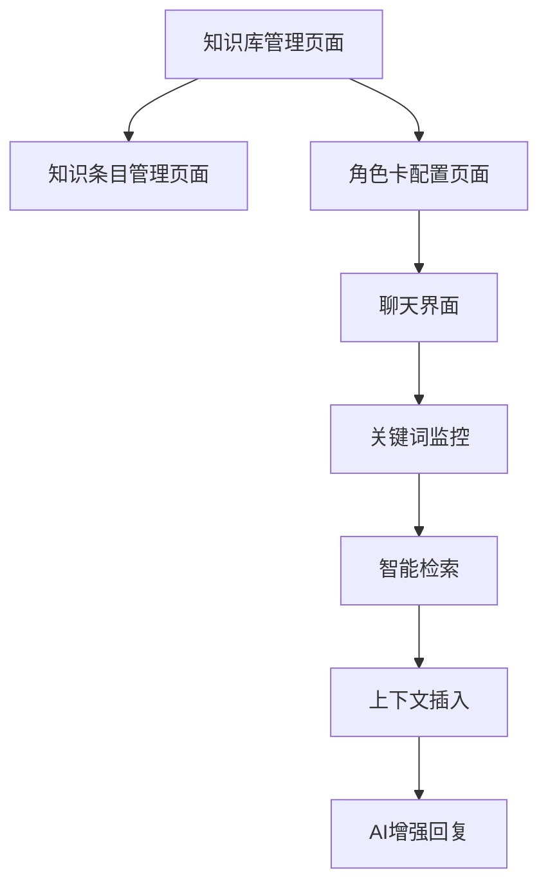

# 知识库功能产品需求文档

## 1. 产品概述

知识库功能是为AI聊天应用增加的智能知识管理系统，允许用户创建和管理结构化的知识条目，并在聊天过程中自动检索相关信息作为上下文提示。

该功能解决了AI聊天中缺乏特定领域知识的问题，通过关键词匹配和智能检索，为用户提供更准确、更专业的对话体验。

## 2. 核心功能

### 2.1 用户角色

| 角色 | 注册方式 | 核心权限 |
|------|----------|----------|
| 普通用户 | 邮箱注册或匿名使用 | 可创建和管理个人知识库，为角色卡指定知识库 |
| 高级用户 | 付费升级 | 可创建更多知识库，支持更大的条目数量 |

### 2.2 功能模块

我们的知识库功能包含以下主要页面：

1. **知识库管理页面**：知识库列表、创建知识库、编辑知识库基本信息
2. **知识条目管理页面**：条目列表、添加条目、编辑条目、删除条目
3. **角色卡配置页面**：为角色卡指定关联的知识库
4. **聊天增强功能**：关键词监控、自动检索、上下文插入

### 2.3 页面详情

| 页面名称 | 模块名称 | 功能描述 |
|----------|----------|----------|
| 知识库管理页面 | 知识库列表 | 显示用户创建的所有知识库，支持搜索、排序、分页 |
| 知识库管理页面 | 创建知识库 | 创建新知识库，设置名称、描述、分类标签 |
| 知识库管理页面 | 编辑知识库 | 修改知识库基本信息，管理访问权限 |
| 知识条目管理页面 | 条目列表 | 显示指定知识库中的所有条目，支持搜索和筛选 |
| 知识条目管理页面 | 添加条目 | 创建新的知识条目，输入名称、关键词、详细解释 |
| 知识条目管理页面 | 编辑条目 | 修改现有条目的内容，更新关键词和解释 |
| 知识条目管理页面 | 批量导入 | 支持CSV/JSON格式批量导入知识条目 |
| 角色卡配置页面 | 知识库关联 | 为角色卡选择和配置关联的知识库 |
| 角色卡配置页面 | 检索设置 | 配置关键词匹配策略和检索优先级 |
| 聊天界面 | 关键词监控 | 实时监控用户输入，识别知识库中的关键词 |
| 聊天界面 | 智能检索 | 根据关键词从知识库中检索相关条目 |
| 聊天界面 | 上下文插入 | 将检索到的知识条目作为系统提示词插入对话 |

## 3. 核心流程

### 管理员流程
1. 创建知识库 → 添加知识条目 → 配置关键词 → 为角色卡关联知识库
2. 管理现有知识库 → 编辑条目内容 → 优化关键词匹配

### 用户聊天流程
1. 选择配置了知识库的角色卡 → 开始对话 → 系统监控输入关键词 → 自动检索相关条目 → 插入上下文提示 → AI基于增强信息回复

## 4. 用户界面设计

### 4.1 设计风格

- 主色调：#3B82F6（蓝色），辅助色：#10B981（绿色）
- 按钮样式：圆角设计，悬停效果，渐变背景
- 字体：系统默认字体，标题16px，正文14px，说明文字12px
- 布局风格：卡片式设计，左侧导航，响应式布局
- 图标风格：线性图标，统一的视觉语言

### 4.2 页面设计概览

| 页面名称 | 模块名称 | UI元素 |
|----------|----------|--------|
| 知识库管理页面 | 知识库列表 | 卡片式布局，每个知识库显示名称、描述、条目数量、创建时间，支持搜索框和筛选器 |
| 知识库管理页面 | 创建知识库 | 模态框形式，包含名称输入框、描述文本域、分类选择器、确认和取消按钮 |
| 知识条目管理页面 | 条目列表 | 表格形式，显示条目名称、关键词标签、创建时间，支持排序和分页 |
| 知识条目管理页面 | 编辑条目 | 表单布局，名称输入框、关键词标签输入、富文本编辑器用于解释内容 |
| 角色卡配置页面 | 知识库关联 | 下拉选择器选择知识库，开关控件启用/禁用知识库功能 |
| 聊天界面 | 知识增强提示 | 浮动提示框显示检索到的知识条目，可展开查看详细内容 |

### 4.3 响应式设计

采用移动优先的响应式设计，支持桌面端和移动端的良好体验，在移动端优化触摸交互和滑动操作。