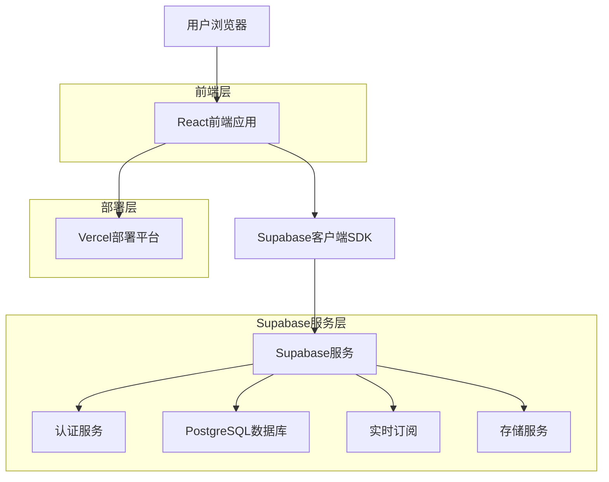
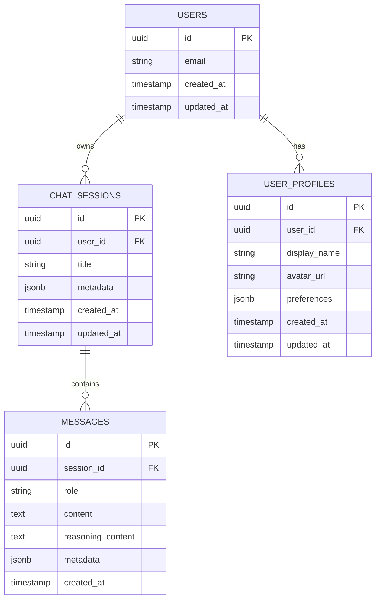

# AI聊天工具用户系统技术架构文档

## 1. 架构设计



## 2. 技术描述

* 前端：React\@18 + TypeScript + Tailwind CSS + Vite

* 认证：Supabase Auth（内置邮箱认证 + 第三方OAuth）

* 数据库：Supabase PostgreSQL + 行级安全策略（RLS）

* 部署：Vercel（自动部署 + 环境变量管理）

## 3. 数据服务

* Supabase：用户认证、数据存储、实时同步

* Vercel：静态资源托管、环境变量管理

## 4. API定义

### 4.1 认证相关API

**用户注册**

```typescript
// 使用Supabase客户端SDK
const { data, error } = await supabase.auth.signUp({
  email: 'user@example.com',
  password: 'password123'
})
```

**用户登录**

```typescript
const { data, error } = await supabase.auth.signInWithPassword({
  email: 'user@example.com',
  password: 'password123'
})
```

**第三方登录**

```typescript
const { data, error } = await supabase.auth.signInWithOAuth({
  provider: 'google'
})
```

### 4.2 数据操作API

**获取用户会话列表**

```typescript
const { data, error } = await supabase
  .from('chat_sessions')
  .select('*')
  .eq('user_id', userId)
  .order('updated_at', { ascending: false })
```

**创建新会话**

```typescript
const { data, error } = await supabase
  .from('chat_sessions')
  .insert({
    user_id: userId,
    title: '新对话',
    created_at: new Date().toISOString()
  })
```

## 5. 数据模型

### 5.1 数据模型定义



### 5.2 数据定义语言（DDL）

**用户资料表（user\_profiles）**

```sql
-- 创建用户资料表
CREATE TABLE user_profiles (
    id UUID PRIMARY KEY DEFAULT gen_random_uuid(),
    user_id UUID REFERENCES auth.users(id) ON DELETE CASCADE,
    display_name VARCHAR(100),
    avatar_url TEXT,
    preferences JSONB DEFAULT '{}',
    created_at TIMESTAMP WITH TIME ZONE DEFAULT NOW(),
    updated_at TIMESTAMP WITH TIME ZONE DEFAULT NOW()
);

-- 创建索引
CREATE UNIQUE INDEX idx_user_profiles_user_id ON user_profiles(user_id);
CREATE INDEX idx_user_profiles_created_at ON user_profiles(created_at DESC);

-- 启用行级安全
ALTER TABLE user_profiles ENABLE ROW LEVEL SECURITY;

-- 创建RLS策略
CREATE POLICY "用户只能访问自己的资料" ON user_profiles
    FOR ALL USING (auth.uid() = user_id);
```

**聊天会话表（chat\_sessions）**

```sql
-- 创建聊天会话表
CREATE TABLE chat_sessions (
    id UUID PRIMARY KEY DEFAULT gen_random_uuid(),
    user_id UUID REFERENCES auth.users(id) ON DELETE CASCADE,
    title VARCHAR(200) NOT NULL DEFAULT '新对话',
    metadata JSONB DEFAULT '{}',
    created_at TIMESTAMP WITH TIME ZONE DEFAULT NOW(),
    updated_at TIMESTAMP WITH TIME ZONE DEFAULT NOW()
);

-- 创建索引
CREATE INDEX idx_chat_sessions_user_id ON chat_sessions(user_id);
CREATE INDEX idx_chat_sessions_updated_at ON chat_sessions(updated_at DESC);

-- 启用行级安全
ALTER TABLE chat_sessions ENABLE ROW LEVEL SECURITY;

-- 创建RLS策略
CREATE POLICY "用户只能访问自己的会话" ON chat_sessions
    FOR ALL USING (auth.uid() = user_id);
```

**消息表（messages）**

```sql
-- 创建消息表
CREATE TABLE messages (
    id UUID PRIMARY KEY DEFAULT gen_random_uuid(),
    session_id UUID REFERENCES chat_sessions(id) ON DELETE CASCADE,
    role VARCHAR(20) NOT NULL CHECK (role IN ('user', 'assistant', 'system')),
    content TEXT NOT NULL,
    reasoning_content TEXT,
    metadata JSONB DEFAULT '{}',
    created_at TIMESTAMP WITH TIME ZONE DEFAULT NOW()
);

-- 创建索引
CREATE INDEX idx_messages_session_id ON messages(session_id);
CREATE INDEX idx_messages_created_at ON messages(created_at DESC);

-- 启用行级安全
ALTER TABLE messages ENABLE ROW LEVEL SECURITY;

-- 创建RLS策略
CREATE POLICY "用户只能访问自己会话的消息" ON messages
    FOR ALL USING (
        EXISTS (
            SELECT 1 FROM chat_sessions 
            WHERE chat_sessions.id = messages.session_id 
            AND chat_sessions.user_id = auth.uid()
        )
    );
```

**自动更新时间戳函数**

```sql
-- 创建更新时间戳函数
CREATE OR REPLACE FUNCTION update_updated_at_column()
RETURNS TRIGGER AS $$
BEGIN
    NEW.updated_at = NOW();
    RETURN NEW;
END;
$$ language 'plpgsql';

-- 为相关表创建触发器
CREATE TRIGGER update_user_profiles_updated_at 
    BEFORE UPDATE ON user_profiles 
    FOR EACH ROW EXECUTE FUNCTION update_updated_at_column();

CREATE TRIGGER update_chat_sessions_updated_at 
    BEFORE UPDATE ON chat_sessions 
    FOR EACH ROW EXECUTE FUNCTION update_updated_at_column();
```

## 6. 认证与安全策略

### 6.1 认证流程

1. **用户注册**：邮箱验证 → 创建用户资料 → 自动登录
2. **用户登录**：凭据验证 → 生成JWT令牌 → 设置会话
3. **会话管理**：自动刷新令牌 → 安全登出 → 会话过期处理

### 6.2 数据隔离策略

**行级安全策略（RLS）**

* 每个表都启用RLS，确保用户只能访问自己的数据

* 使用`auth.uid()`函数获取当前认证用户ID

* 在查询时自动应用安全过滤条件

**前端安全措施**

* 敏感操作需要重新验证身份

* 客户端数据加密存储

* 防止XSS和CSRF攻击

## 7. 部署配置

### 7.1 环境变量配置

**Vercel环境变量**

```bash
# Supabase配置
VITE_SUPABASE_URL=https://abgdmktosbxjjvrhdmcl.supabase.co
VITE_SUPABASE_ANON_KEY=eyJhbGciOiJIUzI1NiIsInR5cCI6IkpXVCJ9...

# 应用配置
VITE_APP_NAME=AI聊天工具
VITE_APP_VERSION=1.0.0
```

### 7.2 Supabase配置

**认证设置**

* 启用邮箱认证

* 配置OAuth提供商（Google、GitHub）

* 设置邮箱模板和重定向URL

**数据库设置**

* 执行DDL脚本创建表结构

* 配置RLS策略

* 设置备份和监控

### 7.3 部署流程

1. **代码提交** → GitHub仓库
2. **自动构建** → Vercel检测变更并构建
3. **环境变量** → 自动注入配置
4. **部署完成** → 生成预览和生产URL

## 8. 实时功能

### 8.1 实时数据同步

```typescript
// 订阅会话变更
const subscription = supabase
  .channel('chat_sessions')
  .on('postgres_changes', {
    event: '*',
    schema: 'public',
    table: 'chat_sessions',
    filter: `user_id=eq.${userId}`
  }, (payload) => {
    // 处理会话变更
    handleSessionChange(payload)
  })
  .subscribe()
```

### 8.2 离线支持

* 使用Service Worker缓存关键资源

* 本地存储临时数据

* 网络恢复时自动同步

