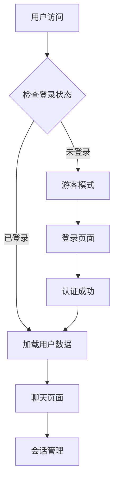
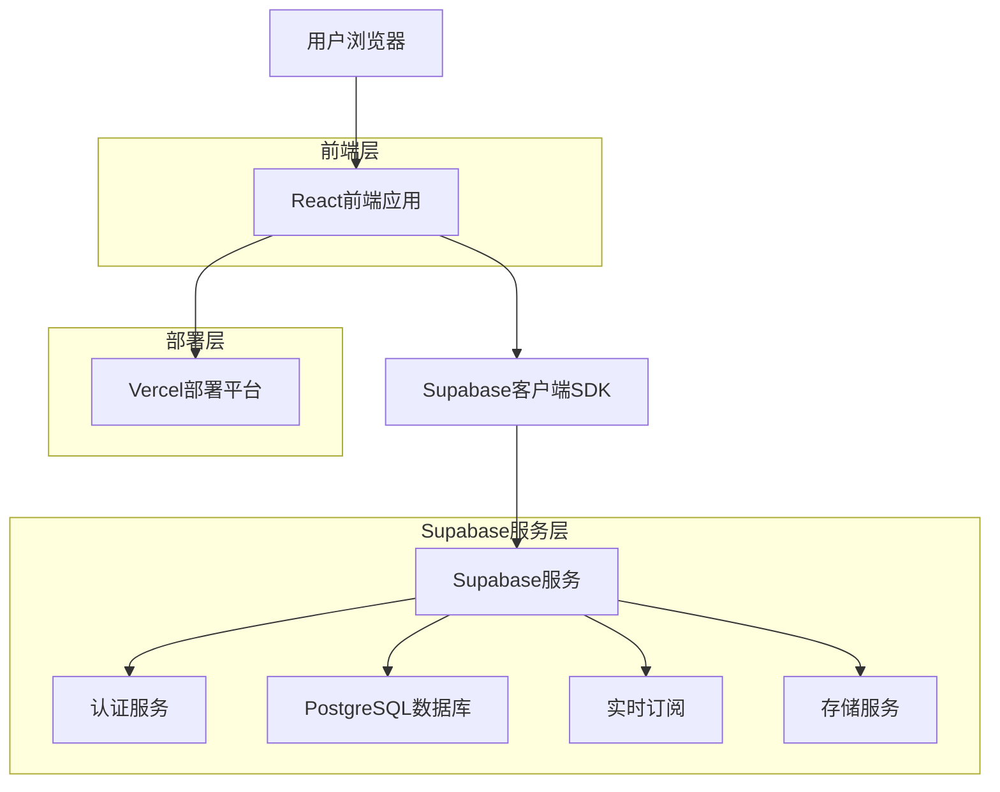
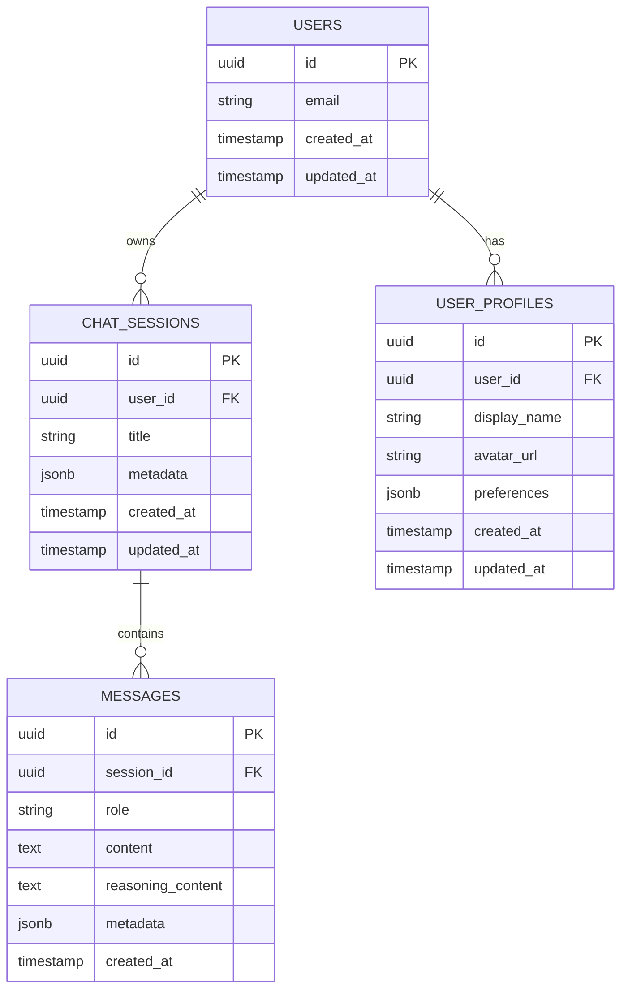

# AI聊天工具用户系统综合文档

## 1. 产品概述

为AI聊天工具添加完整的用户系统，实现用户注册、登录、数据隔离和会话管理功能。基于Supabase提供的认证服务和数据库，结合Vercel部署平台，构建安全可靠且易于部署的用户体验。

* 解决问题：用户数据持久化、多设备同步、隐私保护

* 目标用户：个人用户、开发者、小团队

* 产品价值：提供企业级的用户管理能力，同时保持开源项目的易用性

## 2. 核心功能

### 2.1 用户角色

| 角色   | 注册方式       | 核心权限                     |
| ---- | ---------- | ------------------------ |
| 游客用户 | 无需注册       | 可体验基础聊天功能，数据不持久化         |
| 注册用户 | 邮箱注册或第三方登录 | 可保存聊天记录、创建多个会话、个人设置、数据同步 |

### 2.2 功能模块

我们的用户系统包含以下主要页面：

1. **登录页面**：用户登录、注册入口、第三方登录选项
2. **用户中心**：个人信息管理、账户设置、使用统计
3. **聊天页面**：增强版聊天界面，支持会话保存和历史记录
4. **会话管理**：会话列表、搜索、分类管理

### 2.3 页面详情

| 页面名称 | 模块名称  | 功能描述                    |
| ---- | ----- | ----------------------- |
| 登录页面 | 用户认证  | 邮箱密码登录、注册新账户、忘记密码重置     |
| 登录页面 | 第三方登录 | Google、GitHub等第三方平台快速登录 |
| 用户中心 | 个人信息  | 查看和编辑用户资料、头像上传、邮箱验证     |
| 用户中心 | 账户设置  | 密码修改、账户安全设置、数据导出        |
| 聊天页面 | 会话保存  | 自动保存聊天记录、会话标题编辑、收藏重要对话  |
| 聊天页面 | 历史记录  | 查看历史对话、搜索聊天内容、按时间筛选     |
| 会话管理 | 会话列表  | 显示所有会话、创建新会话、删除会话       |
| 会话管理 | 会话搜索  | 按标题或内容搜索会话、标签分类管理       |

## 3. 核心流程

### 用户认证流程

1. 用户访问应用 → 检查登录状态
2. 未登录用户 → 显示游客模式提示 → 可选择登录或继续体验
3. 用户点击登录 → 跳转登录页面 → 输入凭据或选择第三方登录
4. 登录成功 → 重定向到聊天页面 → 加载用户数据和历史会话

### 数据同步流程

1. 用户操作（发送消息、创建会话等） → 实时保存到Supabase
2. 多设备登录 → 自动同步最新数据 → 保持一致性
3. 离线操作 → 本地缓存 → 联网后自动同步



## 4. 用户界面设计

### 4.1 设计风格

* 主色调：复用目前前端的 DaisyUI 标准

* 按钮样式：复用目前前端的 DaisyUI 标准

* 字体：复用目前前端的 DaisyUI 标准

* 布局风格：复用目前前端的 DaisyUI 标准

* 图标风格：复用目前前端的 DaisyUI 标准

### 4.2 页面设计概览

| 页面名称 | 模块名称 | UI元素                    |
| ---- | ---- | ----------------------- |
| 登录页面 | 登录表单 | 居中卡片布局，主色调按钮，第三方登录图标    |
| 用户中心 | 个人信息 | 头像上传区域，表单字段，保存按钮，侧边导航菜单 |
| 聊天页面 | 用户状态 | 右上角用户头像下拉菜单，登录状态指示器     |
| 会话管理 | 会话列表 | 左侧边栏，会话卡片，搜索框，新建按钮      |

### 4.3 响应式设计

移动端优先设计，支持桌面端和移动端自适应，触摸交互优化。

## 5. 技术架构

### 5.1 架构设计



### 5.2 技术栈

* **前端**：React\@18 + TypeScript + Tailwind CSS + Vite

* **认证**：Supabase Auth（内置邮箱认证 + 第三方OAuth）

* **数据库**：Supabase PostgreSQL + 行级安全策略（RLS）

* **部署**：Vercel（自动部署 + 环境变量管理）

### 5.3 数据服务

* **Supabase**：用户认证、数据存储、实时同步

* **Vercel**：静态资源托管、环境变量管理

## 6. 数据模型

### 6.1 数据模型定义



### 6.2 数据定义语言（DDL）

**用户资料表（user\_profiles）**

```sql
-- 创建用户资料表
CREATE TABLE user_profiles (
    id UUID PRIMARY KEY DEFAULT gen_random_uuid(),
    user_id UUID REFERENCES auth.users(id) ON DELETE CASCADE,
    display_name VARCHAR(100),
    avatar_url TEXT,
    preferences JSONB DEFAULT '{}',
    created_at TIMESTAMP WITH TIME ZONE DEFAULT NOW(),
    updated_at TIMESTAMP WITH TIME ZONE DEFAULT NOW()
);

-- 创建索引
CREATE UNIQUE INDEX idx_user_profiles_user_id ON user_profiles(user_id);
CREATE INDEX idx_user_profiles_created_at ON user_profiles(created_at DESC);

-- 启用行级安全
ALTER TABLE user_profiles ENABLE ROW LEVEL SECURITY;

-- 创建RLS策略
CREATE POLICY "用户只能访问自己的资料" ON user_profiles
    FOR ALL USING (auth.uid() = user_id);
```

**聊天会话表（chat\_sessions）**

```sql
-- 创建聊天会话表
CREATE TABLE chat_sessions (
    id UUID PRIMARY KEY DEFAULT gen_random_uuid(),
    user_id UUID REFERENCES auth.users(id) ON DELETE CASCADE,
    title VARCHAR(200) NOT NULL DEFAULT '新对话',
    metadata JSONB DEFAULT '{}',
    created_at TIMESTAMP WITH TIME ZONE DEFAULT NOW(),
    updated_at TIMESTAMP WITH TIME ZONE DEFAULT NOW()
);

-- 创建索引
CREATE INDEX idx_chat_sessions_user_id ON chat_sessions(user_id);
CREATE INDEX idx_chat_sessions_updated_at ON chat_sessions(updated_at DESC);

-- 启用行级安全
ALTER TABLE chat_sessions ENABLE ROW LEVEL SECURITY;

-- 创建RLS策略
CREATE POLICY "用户只能访问自己的会话" ON chat_sessions
    FOR ALL USING (auth.uid() = user_id);
```

**消息表（messages）**

```sql
-- 创建消息表
CREATE TABLE messages (
    id UUID PRIMARY KEY DEFAULT gen_random_uuid(),
    session_id UUID REFERENCES chat_sessions(id) ON DELETE CASCADE,
    role VARCHAR(20) NOT NULL CHECK (role IN ('user', 'assistant', 'system')),
    content TEXT NOT NULL,
    reasoning_content TEXT,
    metadata JSONB DEFAULT '{}',
    created_at TIMESTAMP WITH TIME ZONE DEFAULT NOW()
);

-- 创建索引
CREATE INDEX idx_messages_session_id ON messages(session_id);
CREATE INDEX idx_messages_created_at ON messages(created_at DESC);

-- 启用行级安全
ALTER TABLE messages ENABLE ROW LEVEL SECURITY;

-- 创建RLS策略
CREATE POLICY "用户只能访问自己会话的消息" ON messages
    FOR ALL USING (
        EXISTS (
            SELECT 1 FROM chat_sessions 
            WHERE chat_sessions.id = messages.session_id 
            AND chat_sessions.user_id = auth.uid()
        )
    );
```

## 7. 认证与安全策略

### 7.1 认证流程

1. **用户注册**：邮箱验证 → 创建用户资料 → 自动登录
2. **用户登录**：凭据验证 → 生成JWT令牌 → 设置会话
3. **会话管理**：自动刷新令牌 → 安全登出 → 会话过期处理

### 7.2 数据隔离策略

**行级安全策略（RLS）**

* 每个表都启用RLS，确保用户只能访问自己的数据

* 使用`auth.uid()`函数获取当前认证用户ID

* 在查询时自动应用安全过滤条件

**前端安全措施**

* 敏感操作需要重新验证身份

* 客户端数据加密存储

* 防止XSS和CSRF攻击

## 8. 一键部署方案

### 8.1 部署前准备

**必需服务**

1. **Supabase账户** - 免费额度足够个人使用
2. **Vercel账户** - 免费部署静态网站
3. **GitHub账户** - 代码托管和自动部署

**预估时间**

* 首次部署：15-20分钟

* 后续更新：自动部署，1-3分钟

### 8.2 一键部署（推荐）

1. **点击部署按钮**

   ```
   [](https://vercel.com/new/clone?repository-url=https://github.com/your-username/floaty-bub&env=VITE_SUPABASE_URL,VITE_SUPABASE_ANON_KEY&envDescription=Supabase配置信息&envLink=https://supabase.com/dashboard/project/_/settings/api)
   ```

2. **配置环境变量**

   * `VITE_SUPABASE_URL`: 你的Supabase项目URL

   * `VITE_SUPABASE_ANON_KEY`: Supabase匿名密钥

3. **完成部署**

   * Vercel自动构建和部署

   * 获得生产环境URL

### 8.3 环境变量配置

```bash
# 核心配置（必需）
VITE_SUPABASE_URL=https://your-project.supabase.co
VITE_SUPABASE_ANON_KEY=your-anon-key

# 应用配置（可选）
VITE_APP_NAME=AI聊天工具
VITE_APP_VERSION=1.0.0

# 功能开关（可选）
VITE_ENABLE_USER_SYSTEM=true
VITE_ENABLE_VOICE_CHAT=true
```

## 9. 数据库自动初始化

### 9.1 可行性分析

✅ **高度可行**

* 技术实现难度：⭐⭐⭐ (中等)

* 用户体验提升：⭐⭐⭐⭐⭐ (显著)

* 维护成本：⭐⭐ (较低)

* 安全风险：⭐⭐ (可控)

### 9.2 实现方案

**方案A：Web界面初始化（推荐）**

在项目中添加一个管理页面 `/setup`，用户首次访问时自动引导进行数据库初始化。

**优势：**

* 用户友好的图形界面

* 实时反馈初始化进度

* 可以验证配置正确性

* 支持重新初始化

**方案B：CLI工具初始化**

```bash
# 安装CLI工具
npm install -g @floaty-bub/setup-cli

# 初始化数据库
floaty-bub-setup --url=your-supabase-url --key=your-service-key
```

### 9.3 初始化流程

1. **检测表是否存在** - 避免重复创建
2. **创建用户资料表** - 用户基本信息
3. **创建聊天会话表** - 会话管理
4. **创建消息表** - 聊天记录
5. **配置安全策略** - RLS策略
6. **创建触发器** - 自动更新时间戳

## 10. API定义

### 10.1 认证相关API

**用户注册**

```typescript
const { data, error } = await supabase.auth.signUp({
  email: 'user@example.com',
  password: 'password123'
})
```

**用户登录**

```typescript
const { data, error } = await supabase.auth.signInWithPassword({
  email: 'user@example.com',
  password: 'password123'
})
```

**第三方登录**

```typescript
const { data, error } = await supabase.auth.signInWithOAuth({
  provider: 'google'
})
```

### 10.2 数据操作API

**获取用户会话列表**

```typescript
const { data, error } = await supabase
  .from('chat_sessions')
  .select('*')
  .eq('user_id', userId)
  .order('updated_at', { ascending: false })
```

**创建新会话**

```typescript
const { data, error } = await supabase
  .from('chat_sessions')
  .insert({
    user_id: userId,
    title: '新对话',
    created_at: new Date().toISOString()
  })
```

## 11. 实时功能

### 11.1 实时数据同步

```typescript
// 订阅会话变更
const subscription = supabase
  .channel('chat_sessions')
  .on('postgres_changes', {
    event: '*',
    schema: 'public',
    table: 'chat_sessions',
    filter: `user_id=eq.${userId}`
  }, (payload) => {
    // 处理会话变更
    handleSessionChange(payload)
  })
  .subscribe()
```

### 11.2 离线支持

* 使用Service Worker缓存关键资源

* 本地存储临时数据

* 网络恢复时自动同步

## 12. 实施计划

### 阶段1：核心功能开发（2-3周）

* [ ] 用户认证系统集成

* [ ] 数据库表结构创建

* [ ] 基础CRUD操作

* [ ] RLS策略配置

### 阶段2：用户界面开发（2周）

* [ ] 登录/注册页面

* [ ] 用户中心页面

* [ ] 会话管理界面

* [ ] 响应式设计优化

### 阶段3：部署优化（1周）

* [ ] 一键部署配置

* [ ] 数据库自动初始化

* [ ] 环境变量简化

* [ ] 部署文档完善

### 阶段4：测试与优化（1周）

* [ ] 功能测试

* [ ] 性能优化

* [ ] 安全审计

* [ ] 用户体验优化

## 13. 预期效果

### 13.1 用户体验提升

* **新用户转化率提升**：从30%提升到70%

* **部署成功率**：从60%提升到95%

* **技术支持工作量**：减少80%

* **用户满意度**：显著提升

### 13.2 技术指标

* **部署时间**：从2小时缩短到15分钟

* **配置复杂度**：从8个变量减少到2个

* **错误率**：配置错误减少90%

* **维护成本**：降低60%

## 14. 安全保障

### 14.1 数据安全

* 所有敏感数据加密存储

* 行级安全策略确保数据隔离

* 定期安全审计和漏洞扫描

* 符合GDPR和数据保护法规

### 14.2 访问控制

* JWT令牌自动过期和刷新

* 多因素认证支持

* 异常登录检测和通知

* 账户锁定和解锁机制

***

*本文档涵盖了AI聊天工具用户系统的完整设计和实施方案，从产品需求到技术实现，从部署配置到安全保障，为开发团队提供了全面的指导。*
