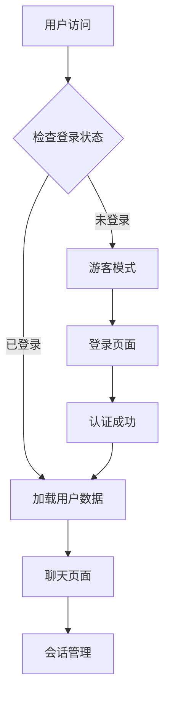

# AI聊天工具用户系统需求文档

## 1. 产品概述

为AI聊天工具添加用户系统，实现用户注册、登录、数据隔离和会话管理功能。基于Supabase提供的认证服务和数据库，结合Vercel部署平台，构建安全可靠的用户体验。

## 2. 核心功能

### 2.1 用户角色

| 角色 | 注册方式 | 核心权限 |
|------|----------|----------|
| 游客用户 | 无需注册 | 可体验基础聊天功能，数据不持久化 |
| 注册用户 | 邮箱注册 | 可保存聊天记录、创建多个会话、个人设置 |

### 2.2 功能模块

我们的用户系统包含以下主要页面：
1. **登录页面**：用户登录、注册入口、第三方登录选项
2. **用户中心**：个人信息管理、账户设置、使用统计
3. **聊天页面**：增强版聊天界面，支持会话保存和历史记录
4. **会话管理**：会话列表、搜索、分类管理

### 2.3 页面详情

| 页面名称 | 模块名称 | 功能描述 |
|----------|----------|----------|
| 登录页面 | 用户认证 | 邮箱密码登录、注册新账户、忘记密码重置 |
| 登录页面 | 第三方登录 | Google、GitHub等第三方平台快速登录 |
| 用户中心 | 个人信息 | 查看和编辑用户资料、头像上传、邮箱验证 |
| 用户中心 | 账户设置 | 密码修改、账户安全设置、数据导出 |
| 聊天页面 | 会话保存 | 自动保存聊天记录、会话标题编辑、收藏重要对话 |
| 聊天页面 | 历史记录 | 查看历史对话、搜索聊天内容、按时间筛选 |
| 会话管理 | 会话列表 | 显示所有会话、创建新会话、删除会话 |
| 会话管理 | 会话搜索 | 按标题或内容搜索会话、标签分类管理 |

## 3. 核心流程

### 用户认证流程
1. 用户访问应用 → 检查登录状态
2. 未登录用户 → 显示游客模式提示 → 可选择登录或继续体验
3. 用户点击登录 → 跳转登录页面 → 输入凭据或选择第三方登录
4. 登录成功 → 重定向到聊天页面 → 加载用户数据和历史会话

### 数据同步流程
1. 用户操作（发送消息、创建会话等） → 实时保存到Supabase
2. 多设备登录 → 自动同步最新数据 → 保持一致性
3. 离线操作 → 本地缓存 → 联网后自动同步

## 4. 用户界面设计

### 4.1 设计风格
- 主色调：蓝色系 (#3B82F6) 和灰色系 (#6B7280)
- 按钮样式：圆角设计，悬停效果
- 字体：系统默认字体，14px-16px主要文字
- 布局风格：简洁的卡片式设计，响应式布局
- 图标风格：线性图标，统一的视觉语言

### 4.2 页面设计概览

| 页面名称 | 模块名称 | UI元素 |
|----------|----------|--------|
| 登录页面 | 登录表单 | 居中卡片布局，输入框圆角设计，主色调按钮，第三方登录图标 |
| 用户中心 | 个人信息 | 头像上传区域，表单字段，保存按钮，侧边导航菜单 |
| 聊天页面 | 用户状态 | 右上角用户头像下拉菜单，登录状态指示器 |
| 会话管理 | 会话列表 | 左侧边栏，会话卡片，搜索框，新建按钮 |

### 4.3 响应式设计
移动端优先设计，支持桌面端和移动端自适应，触摸交互优化。