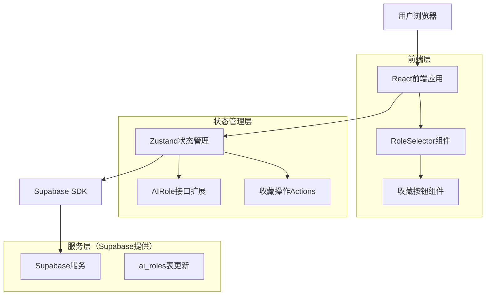

# 角色收藏功能技术架构文档

## 1. 架构设计



## 2. 技术描述

- 前端：React@18 + TypeScript + Tailwind CSS + Lucide React图标
- 状态管理：Zustand + persist中间件
- 后端：Supabase（PostgreSQL数据库 + 实时同步）
- 图标库：Lucide React（Heart图标）

## 3. 路由定义

| 路由 | 用途 |
|------|------|
| /chat | 角色选择页面，显示收藏角色和全部角色列表 |
| /setting/roles | 角色管理页面，可设置角色收藏状态 |

## 4. API定义

### 4.1 数据结构扩展

AIRole接口扩展：
```typescript
export interface AIRole {
  id: string;
  name: string;
  description: string;
  systemPrompt: string;
  openingMessages?: string[];
  currentOpeningIndex?: number;
  avatar?: string;
  globalPromptId?: string;
  globalPromptIds?: string[];
  voiceModelId?: string;
  isFavorite?: boolean; // 新增：收藏状态
  createdAt: Date;
  updatedAt: Date;
}
```

### 4.2 状态管理Actions

```typescript
// 切换角色收藏状态
toggleRoleFavorite: (roleId: string) => void;

// 获取收藏角色列表
getFavoriteRoles: () => AIRole[];

// 批量设置收藏状态
setRoleFavorites: (roleIds: string[]) => void;
```

### 4.3 组件Props接口

```typescript
// 收藏按钮组件
interface FavoriteButtonProps {
  roleId: string;
  isFavorite: boolean;
  onToggle: (roleId: string) => void;
  className?: string;
}

// 角色卡片组件扩展
interface RoleCardProps {
  role: AIRole;
  onSelect: (roleId: string) => void;
  onFavoriteToggle: (roleId: string) => void;
  showFavoriteButton?: boolean;
}
```

## 5. 数据模型

### 5.1 数据库表结构更新

ai_roles表添加字段：
```sql
-- 添加收藏状态字段
ALTER TABLE ai_roles 
ADD COLUMN is_favorite BOOLEAN DEFAULT FALSE;

-- 创建索引以优化收藏角色查询
CREATE INDEX idx_ai_roles_favorite ON ai_roles(is_favorite) 
WHERE is_favorite = TRUE;
```

### 5.2 数据同步策略

1. **本地优先**：收藏操作立即更新本地状态
2. **异步同步**：通过现有的queueDataSync机制同步到云端
3. **冲突解决**：以最新的updatedAt时间戳为准
4. **离线支持**：本地状态持久化，网络恢复后自动同步

## 6. 实现细节

### 6.1 组件结构

```
src/components/
├── RoleSelector.tsx (主要修改)
├── FavoriteButton.tsx (新增)
└── RoleCard.tsx (可选：提取角色卡片为独立组件)
```

### 6.2 状态管理更新

```typescript
// store/index.ts 中添加
toggleRoleFavorite: (roleId: string) => {
  let updatedRole: AIRole | null = null;
  set((state) => {
    const newRoles = state.aiRoles.map(role => {
      if (role.id === roleId) {
        updatedRole = { 
          ...role, 
          isFavorite: !role.isFavorite,
          updatedAt: new Date() 
        };
        return updatedRole;
      }
      return role;
    });
    return { aiRoles: newRoles };
  });
  
  // 同步到云端
  if (updatedRole) {
    queueDataSync('ai_role', updatedRole);
  }
},

getFavoriteRoles: () => {
  return get().aiRoles.filter(role => role.isFavorite);
}
```

### 6.3 UI交互逻辑

1. **收藏按钮显示**：
   - 桌面端：hover时显示
   - 移动端：始终显示
   - 使用CSS媒体查询区分

2. **动画效果**：
   - 按钮出现：opacity + scale动画
   - 点击反馈：scale缩放效果
   - 收藏状态切换：心形图标填充动画

3. **视觉反馈**：
   - 未收藏：空心Heart图标
   - 已收藏：实心Heart图标 + 金色/红色
   - hover状态：图标放大 + 背景色变化

### 6.4 性能优化

1. **列表渲染优化**：使用React.memo优化角色卡片组件
2. **状态更新优化**：收藏操作使用immer模式更新
3. **数据查询优化**：收藏角色列表使用计算属性缓存
4. **图标优化**：使用SVG图标，支持主题色彩动态切换