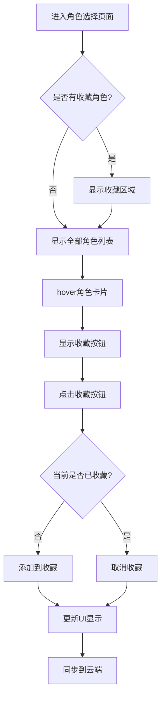

# 角色收藏功能需求文档

## 1. 产品概述

为AI聊天应用的角色选择页面增加收藏功能，让用户能够快速访问常用的AI角色，提升用户体验和使用效率。

该功能将在现有的角色列表基础上，增加收藏/取消收藏操作，并在页面顶部优先展示收藏的角色。

## 2. 核心功能

### 2.1 用户角色

无需区分用户角色，所有用户均可使用收藏功能。

### 2.2 功能模块

角色收藏功能主要涉及以下页面：

1. **角色选择页面**：显示收藏角色区域和全部角色列表，提供收藏操作
2. **角色管理页面**：在角色编辑时可设置收藏状态

### 2.3 页面详情

| 页面名称   | 模块名称     | 功能描述                       |
| ------ | -------- | -------------------------- |
| 角色选择页面 | 收藏角色区域   | 在页面顶部显示已收藏的角色卡片，快速访问常用角色   |
| 角色选择页面 | 角色卡片收藏按钮 | 在hover状态下显示心形收藏图标，点击切换收藏状态 |
| 角色选择页面 | 全部角色列表   | 显示所有角色，包含收藏状态的视觉标识         |
| 角色管理页面 | 收藏状态设置   | 在角色编辑表单中提供收藏开关选项           |

## 3. 核心流程

用户在角色选择页面浏览角色时，可以通过以下流程进行收藏操作：

1. 用户进入角色选择页面
2. 页面顶部显示"我的收藏"区域（如有收藏角色）
3. 下方显示所有角色的网格布局
4. 用户hover角色卡片时，右上角显示收藏按钮
5. 点击收藏按钮，角色被添加到收藏列表
6. 收藏的角色在顶部收藏区域显示
7. 再次点击可取消收藏

## 4. 用户界面设计

### 4.1 设计风格

* 主色调：保持现有的primary色彩系统

* 收藏按钮：使用心形图标（Heart），未收藏时为空心，收藏后为实心

* 动画效果：hover时平滑显示收藏按钮，点击时有缩放反馈

* 布局风格：卡片式布局，保持现有设计一致性

### 4.2 页面设计概览

| 页面名称   | 模块名称   | UI元素                       |
| ------ | ------ | -------------------------- |
| 角色选择页面 | 收藏区域标题 | 标题"我的收藏"，使用h2样式，左对齐，底部有分割线 |
| 角色选择页面 | 收藏角色卡片 | 与普通角色卡片相同，但右上角有金色收藏标识      |
| 角色选择页面 | 收藏按钮   | 位于卡片右上角，圆形背景，心形图标，hover时显示 |
| 角色选择页面 | 空收藏状态  | 当无收藏时不显示收藏区域，直接显示全部角色      |

### 4.3 响应式设计

* 桌面端：收藏区域和全部角色区域均使用3列网格布局

* 平板端：使用2列网格布局

* 移动端：使用1列网格布局

* 收藏按钮在触摸设备上始终显示，无需hover触发

